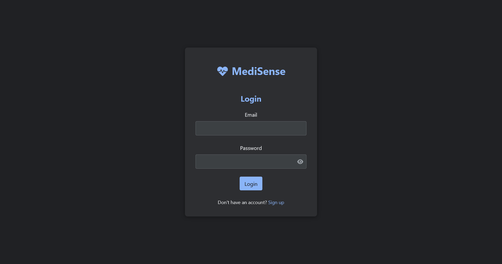
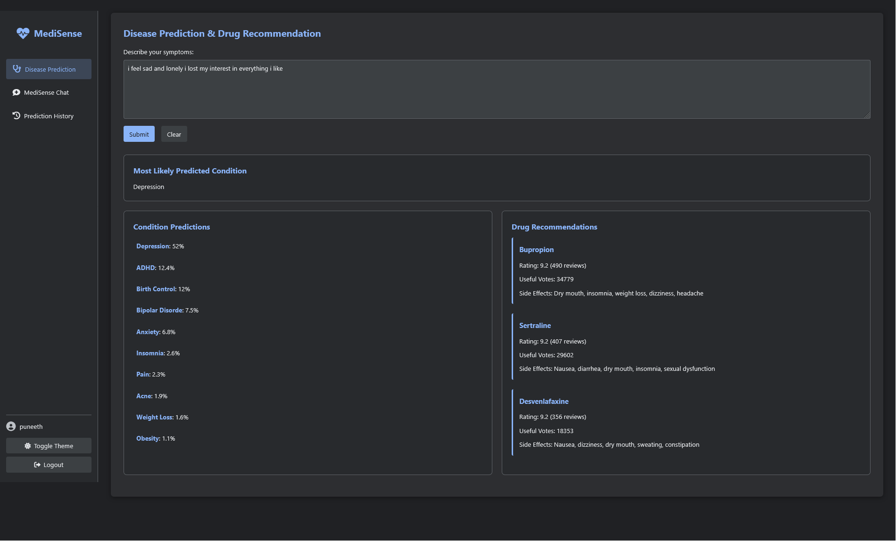
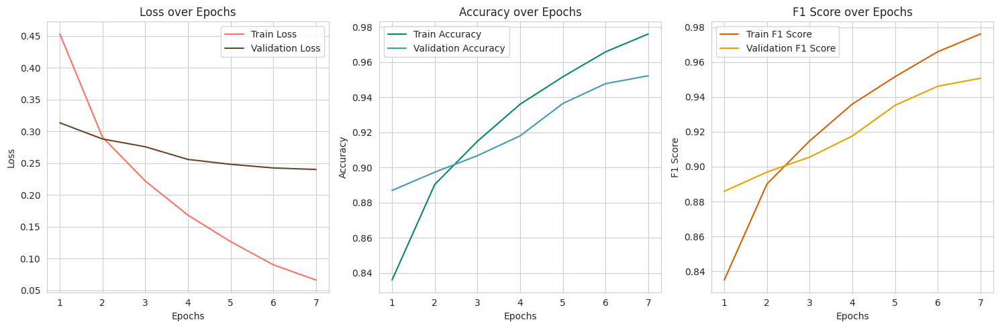
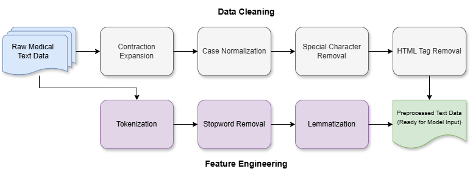
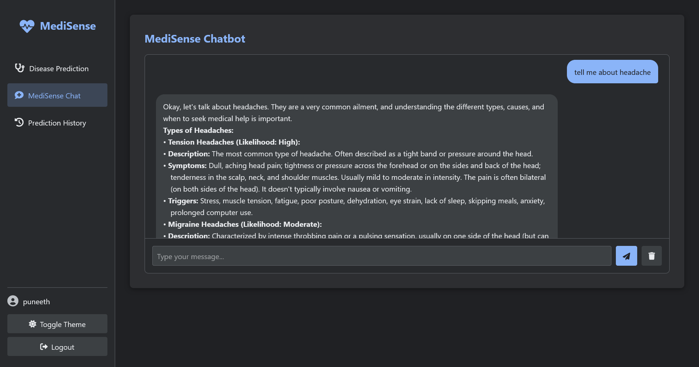
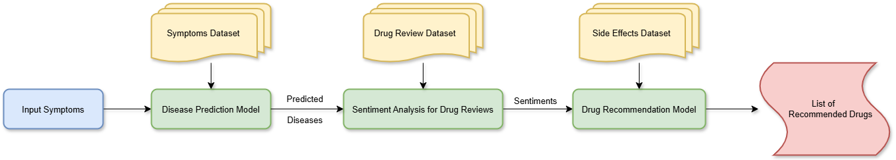

# MediSense: A Smart Disease Prediction and Drug Recommendation System
> *Leveraging Multiple Machine and Deep Learning Techniques for accurate medical diagnosis and treatment recommendations*

## 🎯 Project Overview
MediSense is a cutting-edge machine learning and deep learning system designed to predict diseases based on patient symptoms and recommend appropriate medications. By combining multiple ML and DL approaches, MediSense achieves high accuracy in disease prediction while providing personalized drug recommendations. This project aims to assist healthcare professionals in making faster, more accurate diagnoses and treatment plans.

## 📋 Table of Contents
- [Introduction](#introduction)
- [Key Features](#key-features)
- [Screenshots](#screenshots)
- [Model Performance](#model-performance)
- [Transformer Models in Healthcare](#transformer-models-in-healthcare)
- [Technologies Used](#technologies-used)
- [Setup and Installation](#setup-and-installation)
- [Usage](#usage)
- [Project Status](#project-status)
- [Acknowledgements](#acknowledgements)
- [License](#license)

## 🔍 Introduction
MediSense leverages advanced machine learning techniques to predict diseases from patient symptoms and recommend appropriate medications. The system combines multiple ML and DL approaches to provide healthcare professionals with accurate diagnoses and personalized treatment recommendations.

## ✨ Key Features
- **Multi-model disease prediction** with up to 95.1% accuracy
- **Personalized drug recommendations** based on patient history and symptom severity
- **Comprehensive symptom analysis** using natural language processing
- **Interactive user interface** for both patients and healthcare providers
- **Privacy-focused design** with secure data handling
- **Comparative model evaluation** to ensure highest possible accuracy
- **Explainable AI components** to provide reasoning behind predictions

## 📸 Screenshots
<!-- Add your screenshots here with descriptions -->

*Main interface for entering patient symptoms and viewing predictions*

*Detailed view of drug recommendations with dosage information*

*Interactive visualization of model performance metrics*

*Data preprocessing pipeline showing transformation of raw medical text data into model-ready format*

*Interactive chatbot interface for personalized support and advice*

*Complete system architecture diagram illustrating data flow from symptom input through RoBERTa prediction to final recommendations*

## 📊 Model Performance
Our comprehensive evaluation demonstrates that transformer-based models significantly outperform traditional machine learning approaches for disease prediction:

| Model | Accuracy (%) | Precision | Recall | F1-Score |
|-------|--------------|-----------|--------|----------|
| Passive Aggressive | 81.2 | 0.805 | 0.798 | 0.801 |
| Naive Bayes | 84.7 | 0.838 | 0.832 | 0.835 |
| BiLSTM | 87.9 | 0.871 | 0.865 | 0.868 |
| BERT | 91.6 | 0.908 | 0.899 | 0.903 |
| ModernBERT | 93.3 | 0.925 | 0.918 | 0.921 |
| RoBERTa | **95.1** | **0.943** | **0.937** | **0.940** |

## 🤖 Transformer Models in Healthcare
MediSense leverages the power of transformer-based architectures to achieve state-of-the-art performance in disease prediction:

### BERT and Its Variants
[BERT (Bidirectional Encoder Representations from Transformers)](https://arxiv.org/abs/1810.04805) revolutionized NLP by introducing bidirectional training to language models. In MediSense, we utilize BERT to understand complex symptom descriptions and medical terminology. Our implementation of ModernBERT includes healthcare-specific fine-tuning to better capture medical context.

### RoBERTa
Our highest-performing model uses [RoBERTa (Robustly Optimized BERT Pretraining Approach)](https://arxiv.org/abs/1907.11692), which improves upon BERT with:
- Dynamic masking patterns
- Larger batch sizes
- Longer training sequences
- Improved training methodology

RoBERTa achieves 95.1% accuracy in disease prediction by better capturing the subtle relationships between symptoms and conditions.

### Future Directions
We're exploring integration of GPT-based models for:
- More natural patient-system interactions
- Generation of detailed explanations for predictions
- Analysis of unstructured medical notes and reports

## 💻 Technologies Used
- **Programming Languages**: Python, JavaScript
- **ML/DL Frameworks**: PyTorch, TensorFlow, Hugging Face Transformers
- **Web Technologies**: HTML, CSS, JavaScript
- **Natural Language Processing**: spaCy, NLTK
- **Visualization**: D3.js, Matplotlib
- **Deployment**: Cloudflare Pages

## 🚀 Usage
1. Navigate to `https://major-dnl.pages.dev/` in your web browser
2. Create an account or log in
3. Enter patient symptoms in the prediction interface
4. Review the predicted diseases and their probabilities
5. Check recommended medications for each potential diagnosis
6. Chat with our MediSense chatbot for personalized advice

## 📝 Project Status
MediSense is currently in active development. We are working on:
- Expanding the symptom database
- Integrating more specialized models for rare diseases
- Improving explainability features
- Enhancing the user interface for mobile devices

## 👏 Acknowledgements
- Guru Nanak Institute of Technology Department of AI and Data Science
- Sheetal Kundra for guidance on the implementation
- UCI ML Drug Review dataset for providing anonymized training data
- All contributors and team members who helped build MediSense

## 📄 License
This project is licensed under the MIT License - see the [LICENSE](LICENSE) file for details.